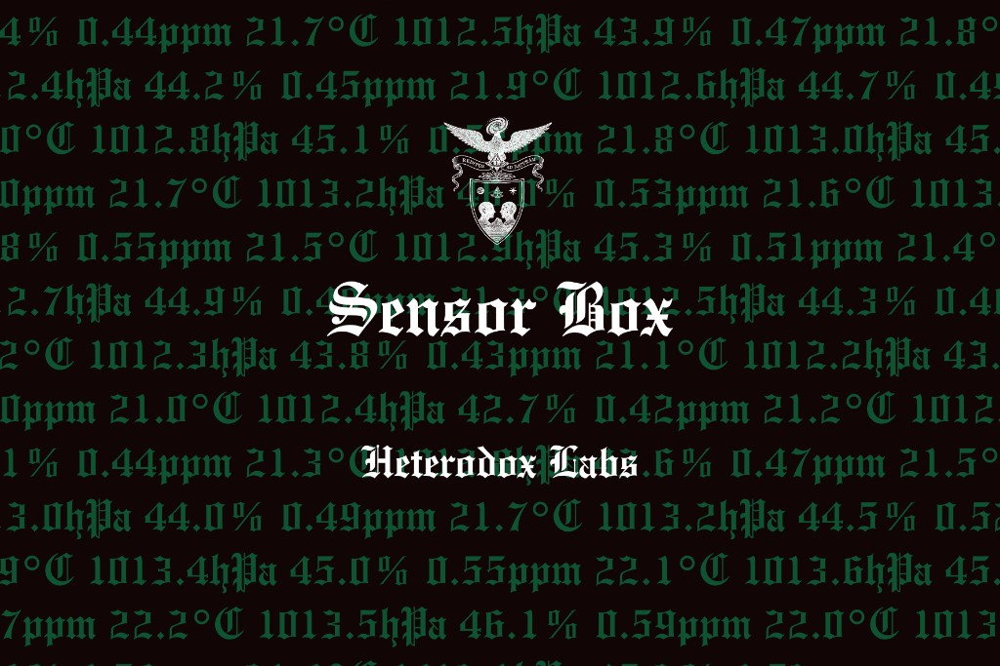

# Sensor Box OS

<p align="center">
  
</p>

Open-source desktop app for the [**EE Sensor Box**](https://shop.experimentengine.ai/products/sensor-box) — a USB environmental monitor that reports temperature, humidity, pressure, and VOC index.

## How to run the app (today)

**Right now, the supported way to use Sensor Box OS is to run it locally from this GitHub repo.** There is not yet a signed, one-click Mac installer we can recommend for everyone.

You will need:

- [Node.js](https://nodejs.org/) 18+
- [Rust](https://www.rust-lang.org/tools/install) 1.77+
- macOS, Windows, or Linux
- An EE Sensor Box on USB (data cable, not charge-only)

### Steps

```bash
git clone https://github.com/avwtr/SensorBox.git
cd SensorBox
npm install
npm run tauri dev
```

The desktop window opens. Use it like a normal app while that command is running.

To build a local `.app` / `.dmg` on your own machine (still unsigned):

```bash
npm ci
npm run tauri build
```

Output is under `src-tauri/target/release/bundle/`.

### Pre-built downloads (coming soon)

We are working on an [**Apple Developer**](https://developer.apple.com/programs/) membership so we can **code-sign and notarize** macOS builds. After that, you’ll be able to download a `.dmg` from [GitHub Releases](https://github.com/avwtr/SensorBox/releases) or our site and open it without macOS blocking it.

Until then:

- **Do not rely on the release DMGs for friends or customers** — unsigned builds often show **“damaged”** or **“can’t be opened”** on other Macs (Gatekeeper), even when they work on yours.
- Experiment Engine’s “Download for Mac” button may stay disabled or point here until signed installers are ready.

---

## Using the app

| Step | What to do |
|------|------------|
| **Begin** | From the welcome screen, start setup. |
| **What to record** | Toggle temperature, humidity, pressure, and/or VOC. At least one is required. |
| **Connect** | Plug in the Sensor Box via USB. The app scans for a likely serial port and connects automatically when it finds one. Use **Choose port manually** if needed. |
| **Record** | **Start recording** runs a session with a timer, live stats, and charts. **Stop** ends the session. |
| **Export** | **Download CSV** or **Download JSON** and save the file wherever you want. Use **Home** to start over. |

### Saving your data

- Sessions exist only on your computer while the app is running.
- After you stop recording, use **Download CSV** or **Download JSON** and pick a folder (e.g. `Documents/SensorBox/`).
- Closing the app or going **Home** without exporting discards that session. There is no cloud backup.

### Troubleshooting connection

- Use a data USB cable (not charge-only).
- On macOS, the port often appears as `cu.usbserial-*` (CP2102N bridge).
- If auto-detect fails, open **Choose port manually** and select your Sensor Box’s USB serial device.
- Baud rate is **115200**.

---

## What it does

1. **Connect** your Sensor Box over USB (auto-detected when possible).
2. **Choose** which metrics to record.
3. **Record** a timed session with live values and charts.
4. **Export** the session as **CSV** or **JSON** to a folder on your computer.

Built with [Tauri 2](https://v2.tauri.app/), React, and TypeScript. Serial I/O runs in Rust; parsing matches Experiment Engine firmware.

---

## For maintainers

### Publish a GitHub Release (unsigned CI builds)

CI builds macOS DMGs on tag push for testing and for the future signed pipeline. Asset names must stay `SensorBox-{version}-macos-aarch64.dmg` and `SensorBox-{version}-macos-x64.dmg` for the Experiment Engine site.

1. Bump `version` in `src-tauri/tauri.conf.json`.
2. Tag and push:

   ```bash
   git tag v0.2.0
   git push origin v0.2.0
   ```

See `.github/workflows/release.yml`.

### Device protocol

Firmware sends tab-separated lines, for example:

```text
tempF:72.5	humidity:45.2	pressure:0.998	lux:1234	voc:125
```

JSON lines are also supported. See `src/lib/sensorParser.ts` for parsing (°F→°C, atm→hPa).

### Project layout

| Path | Purpose |
|------|---------|
| `src/components/screens/` | UI flow (welcome → configure → connect → session → export) |
| `src/hooks/useSensorBox.ts` | Serial ports, connect, live readings |
| `src/lib/sensorParser.ts` | Firmware line parser |
| `src-tauri/src/serial.rs` | Rust serial read loop |

---

## Links

- [Get a Sensor Box](https://shop.experimentengine.ai/products/sensor-box)
- [Experiment Engine](https://www.experimentengine.ai/)
- [Source on GitHub](https://github.com/avwtr/SensorBox)

## Contributing

Issues and pull requests are welcome. Keep parser behavior compatible with EE Sensor Box firmware unless you document a breaking change.

## License

MIT — see [LICENSE](LICENSE).
